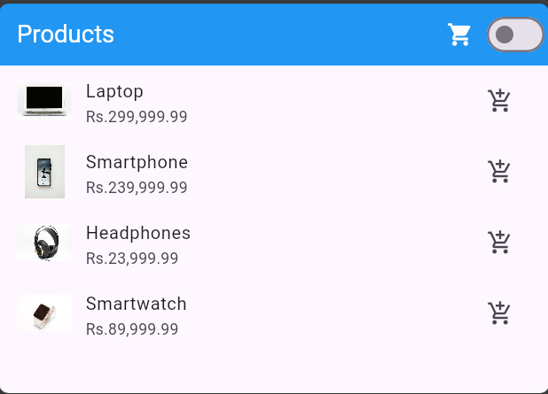
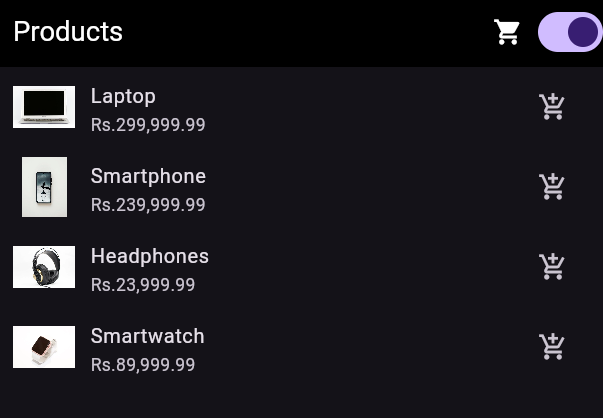

# Shopping Cart App

A Flutter-based mobile application for managing a shopping cart, demonstrating robust state management using the `ChangeNotifier` pattern. The app supports product listing, adding items to a cart, updating quantities, removing items, and toggling between light and dark themes.

## Table of Contents

- [Introduction](#introduction)
- [Prerequisites](#prerequisites)
- [Setup](#setup)
- [Running the App](#running-the-app)
- [Features](#features)

## Introduction

This is a Shopping Cart App built using Flutter. The app allows users to view a list of products and add them to cart, view cart and update cart.

## Prerequisites

- Flutter SDK (version 2.10.0 or later)
- Android Studio or Visual Studio Code
- A physical device or emulator for testing

## Setup

1. Clone the repository using the following command:

```bash
git clone  https://github.com/rasikww/mob-app-dev-assignment-3.git
```

2. Navigate to the project directory

```bash
cd mob-app-dev-assignment-3

```

3. Install the dependencies

```bash
flutter pub get
```

4. Configure the Android Studio or Visual Studio Code

- Android Studio : Open the project in Android Studio and wait for the project to sync.
- Visual Studio Code: Open the project in Visual Studio Code and install the Flutter extension.

## Running the App

1. Connect a physical device or the emulator to your computer.
2. Run the app using the following command:

```bash
flutter run
```

3. The app will launch on the connected device or emulator.

## Features

- **Product Repository**:

  - Displays a list of products fetched from a simulated API.
  - Supports product properties: `id`, `name`, `price`, `image`, and `description`.

- **Shopping Cart**:

  - Add products to the cart.
  - Update quantities or remove products.
  - View total price of items in the cart.
  - Clear the entire cart.

- **State Management**:

  - Implements the `ChangeNotifier` pattern for managing state.
  - Uses `notifyListeners()` for real-time UI updates.

- **Dark Mode**:

  - Toggle between light and dark themes dynamically.
  - Persist theme preferences for user convenience.

- **Persistent Cart State**:
  - Saves cart data to local storage using `shared_preferences`.
  - Restores cart data on app restart.

---

## Screenshots

| Light Theme                                   | Dark Theme                                  |
| --------------------------------------------- | ------------------------------------------- |
|  |  |

---
